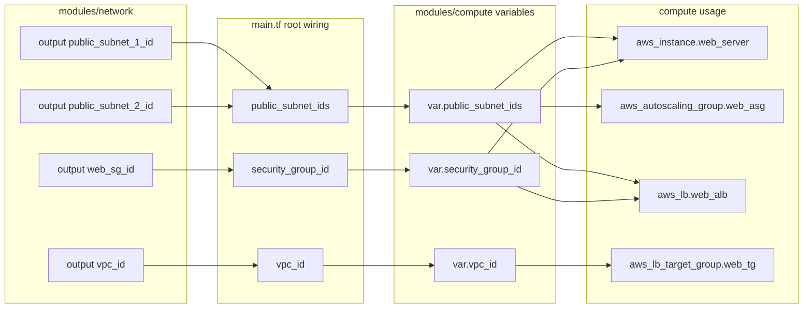

# How main, network, and compute share information

## Overview

This project uses the root module in main.tf to connect two child modules:

- modules/network creates networking resources and exports values as outputs.
- modules/compute receives those exported values as input variables and uses them to create compute resources.

Think of it as:

1. network creates IDs.
2. network outputs publish those IDs.
3. main reads those outputs and passes them into compute inputs.
4. compute consumes those inputs in resources.

## Step-by-step data flow

### 1) Network module creates resources

In modules/network/main.tf, Terraform creates:

- aws_vpc.main
- aws_subnet.public_1
- aws_subnet.public_2
- aws_security_group.web_sg

### 2) Network module exports outputs

In modules/network/outputs.tf, the module exposes values to other modules:

- output public_subnet_1_id -> aws_subnet.public_1.id
- output public_subnet_2_id -> aws_subnet.public_2.id
- output web_sg_id -> aws_security_group.web_sg.id
- output vpc_id -> aws_vpc.main.id

Only outputs declared here can be accessed as module.my_network.<name> in the root module.

### 3) Root module wires network to compute

In main.tf:

- module my_network is instantiated from ./modules/network.
- module my_compute is instantiated from ./modules/compute.

The root module passes network outputs into compute inputs:

- compute.security_group_id = network.web_sg_id
- compute.public_subnet_ids = [network.public_subnet_1_id, network.public_subnet_2_id]
- compute.vpc_id = network.vpc_id

### 4) Compute module declares expected inputs

In modules/compute/variables.tf, compute expects:

- variable security_group_id (string)
- variable public_subnet_ids (list(string))
- variable vpc_id (string)

Input names in main.tf must match these variable names exactly.

### 5) Compute module uses inputs in resources

In modules/compute/main.tf:

- aws_instance.web_server uses
  - subnet_id = var.public_subnet_ids[0]
  - vpc_security_group_ids = [var.security_group_id]
- aws_autoscaling_group.web_asg uses
  - vpc_zone_identifier = var.public_subnet_ids
- aws_lb.web_alb uses
  - security_groups = [var.security_group_id]
  - subnets = var.public_subnet_ids
- aws_lb_target_group.web_tg uses
  - vpc_id = var.vpc_id

### 6) Compute module exports a value back to root

In modules/compute/output.tf:

- output server_public_ip -> aws_instance.web_server.public_ip

In main.tf, root re-exports that as:

- output instance_ip = module.my_compute.server_public_ip

## Relationship map (quick reference)

network output -> main wiring -> compute variable -> used by

public_subnet_1_id + public_subnet_2_id -> public_subnet_ids -> var.public_subnet_ids -> instance subnet, ASG, ALB
web_sg_id -> security_group_id -> var.security_group_id -> EC2 SG, launch template SG, ALB SG
vpc_id -> vpc_id -> var.vpc_id -> target group VPC

## Visual graph (relationship flow)

## Common mistakes and why they fail

- Referencing an output that does not exist in modules/network/outputs.tf.
  - Result: Unsupported attribute on module.my_network.<name>.
- Passing a field in main.tf that is not declared in modules/compute/variables.tf.
  - Result: Unsupported argument in module my_compute.
- Forgetting to pass a required compute variable.
  - Result: Missing required argument.

## Rule to remember

For module-to-module sharing, names must align across three places:

1. network output name
2. root module assignment in main.tf
3. compute variable name
